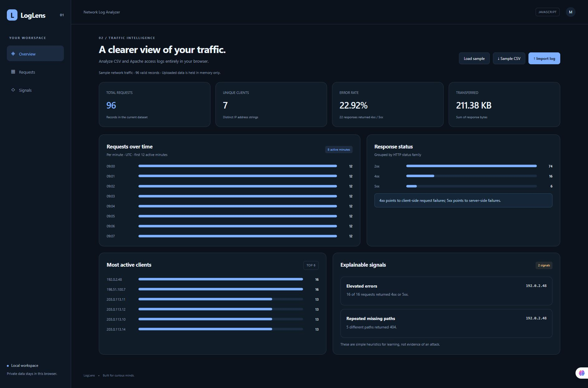

# LogLens — Network Log Analyzer

تحلیل لاگ‌های CSV و Apache در مرورگر، نمایش ترافیک و خطاها، فیلتر درخواست‌ها و بررسی الگوهای قابل توضیح.

A working portfolio project exploring network log analyzer, built with JavaScript, HTML, CSS, and browser APIs.



## Features

- CSV and Apache common/combined access log import, with invalid-row reporting.
- Request timeline, unique clients, response status families, transfer totals, and top IPs.
- Searchable, paginated request table, filtered CSV export, and explainable threshold-based signals.

## Run locally

Use **Node.js 22.13+**. Clone the repository, then run:

```sh
git clone https://github.com/MahtaRahmati/loglens.git
cd loglens
npm start
```

Open **http://127.0.0.1:4100**. The bundled sample provides a starting point; your own data can be entered or imported.

```sh
npm test
```

PORT can be changed through the environment. No dependency installation or build step is required.

## Project structure

- `public/` — responsive interface and browser-side domain logic
- `tests/` — meaningful domain checks
- `server.mjs` — small local static server
- `docs/` — screenshot and bilingual LinkedIn introduction

## Deployment

Serve the public/ folder through any static host. A GitHub Pages workflow is included. Enable **Settings → Pages → Source: GitHub Actions** to publish it. Expected URL after successful deployment: https://MahtaRahmati.github.io/loglens/ .

## Scope & data handling

Client-side analysis only; no network monitoring or intrusion detection. Signals are fixed heuristics, not proof of an attack. Files are limited to 5 MB and CSV input to 50,000 rows. Uploaded logs are kept in memory only. Dates without timezone are interpreted by the browser; use ISO 8601 with an explicit offset.

All sample records and addresses are fictional. The interface works on desktop and mobile and includes keyboard focus states, labeled controls, and status/error feedback.

## Built with

Native ES modules, DOM APIs, and CSS. No framework or chart dependency.

## License

MIT.
